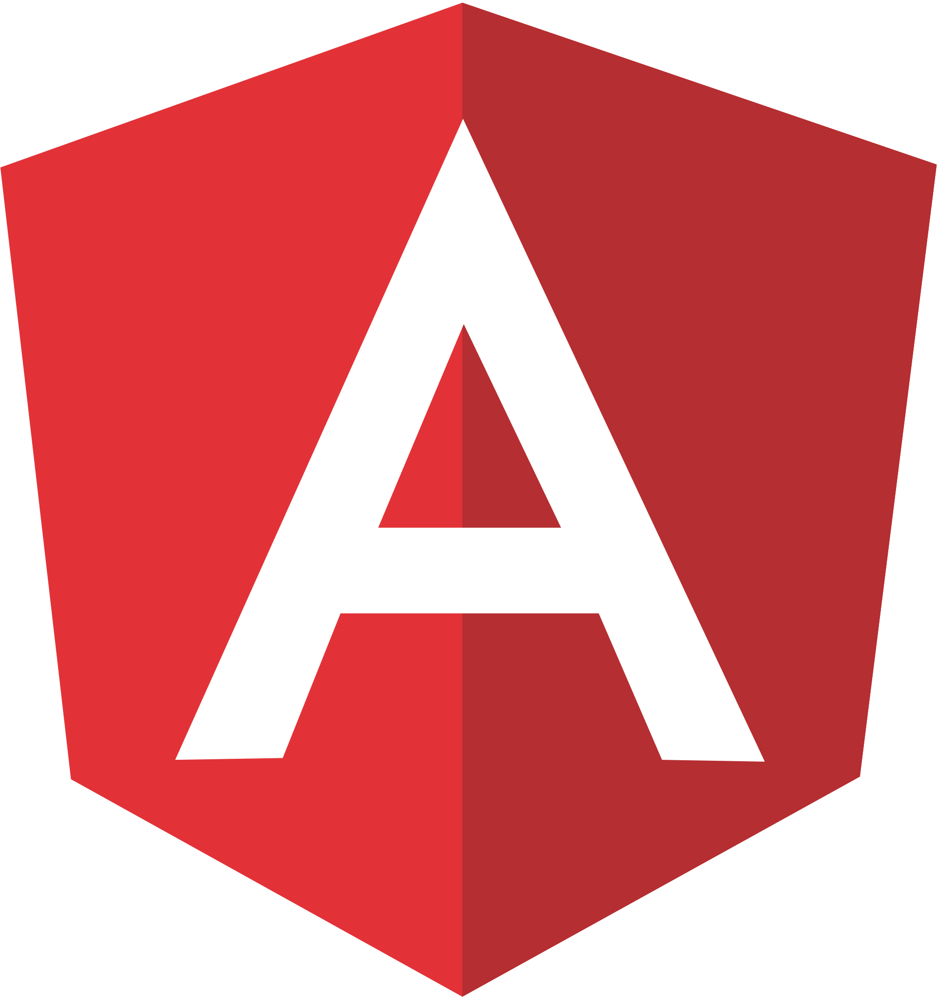

<h1 align="left" id="macropower-title"> Hello there! I'm Abhinavan Roy  </h1>
<h3 align="left">I am a Deviser, executing SDE/SE Engineering things</h3>

  
  
  
  

- :office: &nbsp;I'm currently working at **[Airtel Africa]** 
- :seedling: &nbsp;I’m currently learning **Kotlin**
- :speech_balloon: &nbsp;I like to talk about **Tech** and **Cosmos**
- :mailbox: &nbsp;Ask me anything on my **[issues page]**
- :handshake: &nbsp;Connect with me on **[LinkedIn]**

 

<h2 align="left" id="abhinavanRoy-tech">Favourite Tech </h2>

> Tools, languages, and other things that I like to work with.

<table>
  <tr>
    <td align="center" width="96">
      
       C++
    </td>
    <td align="center" width="96">
      
       MySql
    </td>
     <td align="center" width="96">
      
       TypeScript
    </td>
    <td align="center" width="96">
      
       JavaScript
    </td>
    <td align="center" width="96">
      
       Adobe XD
    </td>
   <td align="center" width="96">
      
       Android Studio
    </td>
     <td align="center" width="96">
      
       Kotlin
    </td>
  </tr>
    <td align="center" width="96">
      
       Sass
    </td>
      <td align="center" width="96"> 
      
       VS Code
    </td>
    <td align="center" width="96"> 
      
       PostgreSQL
    </td>
   <td align="center" width="96"> 
      
       Git
    </td>
     <td align="center" width="96"> 
      
       Angular
    </td>
     <td align="center" width="96"> 
      
       HTML
    </td>
</table>

<!-- links -->

[Airtel Africa]: https://airtel.africa/#/ "Airtel Africa"
[issues page]: https://github.com/abhinavanRoy/abhinavanRoy/issues "abhinavanRoy/issues"
[linkedin]: https://www.linkedin.com/in/abhinavan-roy/ "Abhinavan Roy's LinkedIn"
